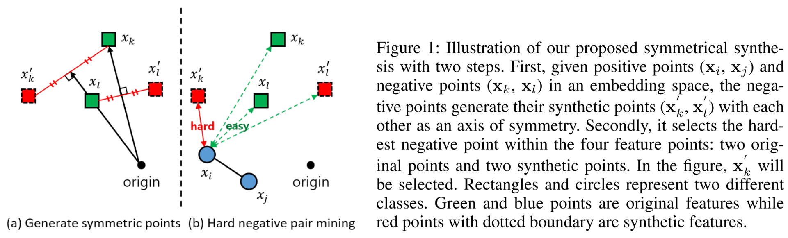
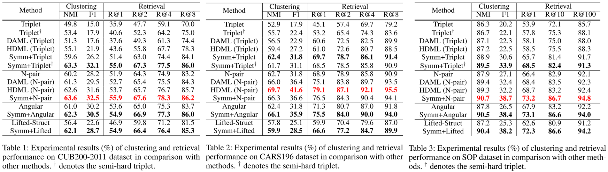

# Symmetrical Synthesis for Deep Metric Learning

Official Tensorflow implementation of Symmetrical Synthesis for Deep Metric Learning (AAAI 2020)

**Geonmo Gu\*, Byungsoo Ko\*** (* Authors contributed equally.)

@NAVER/LINE Vision

- [Paper](https://arxiv.org/abs/2001.11658) | [Supplementary Video](https://www.youtube.com/watch?v=X9mJJKDokEU&feature=youtu.be) | [Poster](https://www.slideshare.net/ByungSooKo1/poster-symmetrical-synthesis-for-deep-metric-learning-aaai2020) | [Spotlight PPT](https://www.slideshare.net/ByungSooKo1/spotlight-ppt-symmetrical-synthesis-for-deep-metric-learning-aaai2020)

## Overview
### Symmetrical Synthesis
Symmetrical Synthesis (Symm) is a novel method of synthetic hard sample generation for deep metric learning.



### How it Works
After some iterations, symmetrical synthesis generates synthetic points around the class clusters, which are used as hard samples to push the other class with stronger power.


### Experimental Results



## Getting Started

### Requirements

```
$ pip3 install -r requirements.txt
```

### Prepare Data

1. Download pretrained GoogleNet model. [ref](https://github.com/Wei2624/Feature_Embed_GoogLeNet)
```
$ wget https://github.com/Wei2624/Feature_Embed_GoogLeNet/raw/master/tf_ckpt_from_caffe.mat
```
2. Download CAR DB and cook.

```
$ wget http://imagenet.stanford.edu/internal/car196/car_ims.tgz
$ tar -xzf car_ims.tgz
$ mv car_ims
$ wget http://imagenet.stanford.edu/internal/car196/cars_annos.mat

# on ../symm_public folder
$ cd dataset
$ python3 cooking_CARS.py --car_folder=/your/car_ims/folder \
--save_path=/your/converted/carDB/will/be/saved/here
```

### Train a Model

- **Available losses**: N-pair, Symm + N-pair, Angular, Symm + Angular

#### Symm + N-pair
```
$ python3 train.py --backbone=googlenet \
--pretrained_model_path=/your/folder/tf_ckpt_from_caffe.mat \
--image_path=/your/converted/carDB/will/be/saved/here \
--run_gpu=0 \
--save_path=/your/trained/model/will/be/saved/here \
--losses=symm_npair --dim_features=512 \
--input_size=227 --learning_rate=0.0001 \
--decay_steps=5000 --decay_stop_steps=15000 \
--decay_stop_value=0.00001 --decay_ratio=0.5 \
--save_model_steps=100
```

### Test a Model
```
$ python3 test.py --run_gpu=1 --model_path=/your/trained/model/will/be/saved/here \
--image_path=/your/converted/carDB/will/be/saved/here \
--batch_size=512 --backbone=googlenet \
--pretrained_model_path=/your/folder/tf_ckpt_from_caffe.mat \
--log_path=eval_log_car \
--input_size=227 --start_idx=0 --dim_features=512
```
+ Best recall@1: 0.77 (0.765 in paper)

### Check Test Results
```
$ tensorboard --logdir=eval_log_car --port=10000
```

## Acknowledgements

+ **Googlenet backbone**
  + https://github.com/wzzheng/HDML/blob/master/lib/GoogleNet_Model.py
  + https://github.com/Wei2624/Feature_Embed_GoogLeNet
  
## Citation
If you find *Symmetrical Synthesis* useful in your research, please consider to cite the following paper.

```
@inproceedings{gu2020symmetrical,
    title={Symmetrical Synthesis for Deep Metric Learning},
    author={Geonmo Gu and Byungsoo Ko},
    booktitle={Proceedings of the AAAI Conference on Artificial Intelligence},
    year={2020}
}
```

## License

```
Copyright (c) 2020-present NAVER Corp.

Permission is hereby granted, free of charge, to any person obtaining a copy
of this software and associated documentation files (the "Software"), to deal
in the Software without restriction, including without limitation the rights
to use, copy, modify, merge, publish, distribute, sublicense, and/or sell
copies of the Software, and to permit persons to whom the Software is
furnished to do so, subject to the following conditions:

The above copyright notice and this permission notice shall be included in
all copies or substantial portions of the Software.

THE SOFTWARE IS PROVIDED "AS IS", WITHOUT WARRANTY OF ANY KIND, EXPRESS OR
IMPLIED, INCLUDING BUT NOT LIMITED TO THE WARRANTIES OF MERCHANTABILITY,
FITNESS FOR A PARTICULAR PURPOSE AND NONINFRINGEMENT.  IN NO EVENT SHALL THE
AUTHORS OR COPYRIGHT HOLDERS BE LIABLE FOR ANY CLAIM, DAMAGES OR OTHER
LIABILITY, WHETHER IN AN ACTION OF CONTRACT, TORT OR OTHERWISE, ARISING FROM,
OUT OF OR IN CONNECTION WITH THE SOFTWARE OR THE USE OR OTHER DEALINGS IN
THE SOFTWARE.
```
